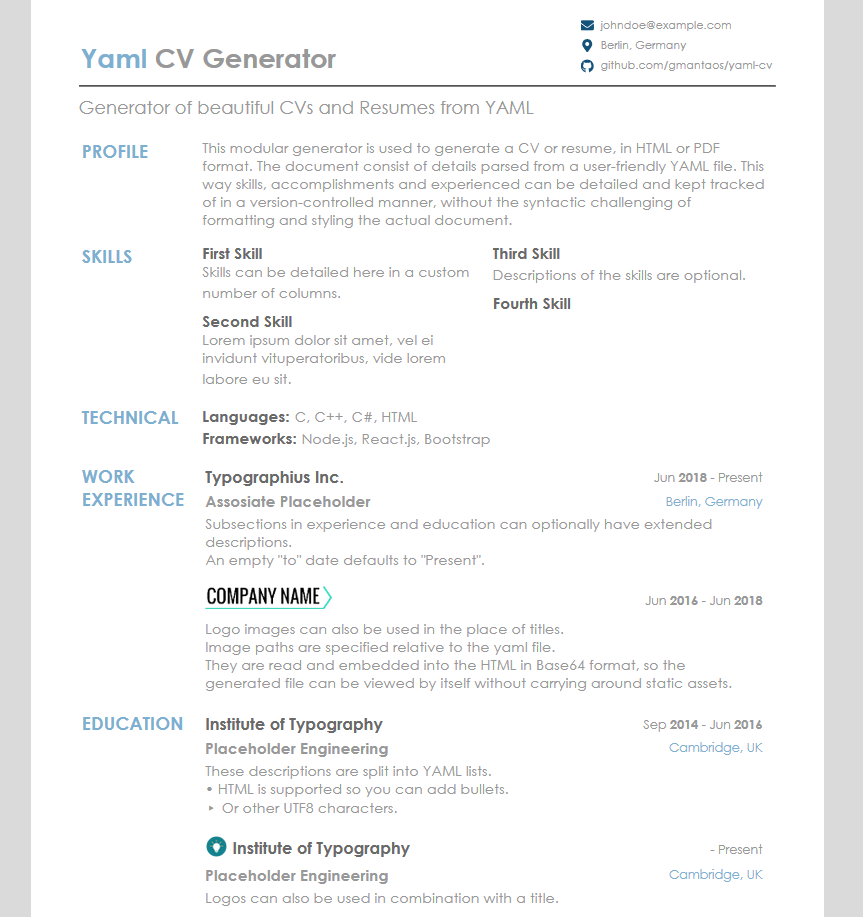

yaml-cv
[ ](https://travis-ci.com/gmantaos/yaml-cv)
[](https://rubygems.org/gems/yaml-cv)
[](LICENSE)
=====================

Static CV generator from a YAML file, in HTML or PDF format.

<h1 align="center">
  
</h1>

## Installation

```shell
$ gem install yaml-cv
```

**Disclaimer:** On versions `0.1` PDF generation will be a little rough, since I implemented the release system before getting around to that.

## Usage

By default, the output will be printed to stdout in HTML format.

```shell
$ yaml-cv my_cv.yml
<html>
<head>
    <title> Doe John - Public Figure </title>

    <style>
...
```

To save to a file, use one or both of the `--html` and `--pdf` arguments, while specifying the output file to write to.

```shell
$ yaml-cv my_cv.yml --html my_cv.html
```

```shell
$ yaml-cv my_cv.yml --pdf my_cv.pdf
```

The `--watch` option can also be used to watch the input file for changes and automatically regenerate the output.

```shell
$ yaml-cv my_cv.yml --html my_cv.html --watch
```
